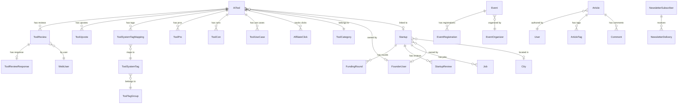

# Database Schema

Entity-Relationship overview of the AI Startup Impact database.

---

## ERD — Core Entities

---

## Table Groups

### User Accounts (3 user types)

| Table | Purpose | Auth |
|-------|---------|------|
| `User` | Admin CMS users | NextAuth (Google) |
| `FounderUser` | Founders managing startups/tools | JWT (Google OAuth) |
| `WebUser` | Public community users | JWT (email/password) |
| `EventOrganizer` | Event organizers | JWT (email/password) |

### AI Tool Directory

| Table | Purpose |
|-------|---------|
| `AiTool` | Core tool listing (name, description, pricing, etc.) |
| `ToolCategory` | Hierarchical categories (parent → subcategory) |
| `ToolTagGroup` | Tag groups (12 groups: use case, industry, etc.) |
| `ToolSystemTag` | Individual tags (254 tags) |
| `ToolSystemTagMapping` | Tool ↔ Tag junction |
| `ToolReview` | User reviews (rating, title, body) |
| `ToolReviewResponse` | Founder response to review |
| `ToolUpvote` | Community upvotes |
| `ToolPro` | Pro bullet points |
| `ToolCon` | Con bullet points |
| `ToolUseCase` | Use case descriptions |
| `ToolAlternative` | Alternative tool links (bidirectional) |
| `ToolTraffic` | Daily traffic stats |
| `AffiliateClick` | Outbound click tracking |
| `SavedTool` | User bookmarks |

### Startup Directory

| Table | Purpose |
|-------|---------|
| `Startup` | Core startup listing |
| `FundingRound` | Funding history (amount, round type, investors) |
| `StartupReview` | User reviews |
| `StartupFAQ` | FAQ items |
| `StartupVerificationLog` | DNS verification audit |
| `StartupBusinessCategory` | Business sector reference |
| `StartupBusinessType` | Business type reference |
| `SavedStartup` | User bookmarks |

### Events

| Table | Purpose |
|-------|---------|
| `Event` | Event listing (date, location, agenda) |
| `EventRegistration` | User registrations |
| `EventOrganizer` | Organizer accounts |
| `OrganizationProfile` | Organization details |

### Content / News

| Table | Purpose |
|-------|---------|
| `Article` | News articles, founder stories |
| `ArticleTag` | Article ↔ Tag junction |
| `ArticleVersion` | Edit history |
| `Comment` | Article comments |
| `Category` | Article categories |
| `Tag` | Content tags |

### Newsletter

| Table | Purpose |
|-------|---------|
| `NewsletterSubscriber` | Email subscribers |
| `NewsletterCampaign` | Email campaigns |
| `NewsletterDelivery` | Delivery tracking |

### Analytics & Tracking

| Table | Purpose |
|-------|---------|
| `PageView` | Page view tracking (session-based) |
| `ToolTraffic` | Daily tool traffic aggregates |
| `AffiliateClick` | Outbound click tracking |

### Admin & Audit

| Table | Purpose |
|-------|---------|
| `AuditLog` | Admin action audit trail |
| `ContentReport` | User-submitted content reports |
| `BreakingTicker` | Breaking news ticker items |

### Advertising

| Table | Purpose |
|-------|---------|
| `AdCampaign` | Ad campaigns |
| `AdCreative` | Ad creatives (text, image, CTA) |
| `AdClick` | Click tracking |
| `AdImpression` | Impression tracking |

---

## Key Enums

| Enum | Values | Used By |
|------|--------|---------|
| `UserRole` | SUPER_ADMIN, EDITOR_IN_CHIEF, SENIOR_WRITER, WRITER, AD_MANAGER, CONTRIBUTOR, EVENT_ORGANIZER | User |
| `ToolApprovalStatus` | PENDING, APPROVED, FEATURED, ARCHIVED | AiTool |
| `CompanyStatus` | ACTIVE, PUBLIC, ACQUIRED, INACTIVE | Startup |
| `StartupStage` | BOOTSTRAPPED, IDEA, PRE_SEED, SEED, PRE_SERIES_A, SERIES_A, SERIES_B, SERIES_C, GROWTH, PUBLIC | Startup |
| `PricingModel` | FREE, FREEMIUM, PAID, ENTERPRISE, OPEN_SOURCE | AiTool |
| `ClaimStatus` | UNCLAIMED, PENDING, CLAIMED, VERIFIED, REJECTED | AiTool, Startup |
| `ListingTier` | FREE, PRIORITY, FEATURED | AiTool |
| `ReviewStatus` | PENDING, APPROVED, REJECTED, FLAGGED | Reviews |
| `ArticleStatus` | DRAFT, IN_REVIEW, REVISION, APPROVED, SCHEDULED, PUBLISHED, ARCHIVED | Article |

---

## Relationships Summary

| Relationship | Type | On Delete |
|-------------|------|-----------|
| AiTool → ToolCategory | Many-to-One | Required |
| AiTool → FounderUser | Many-to-One (optional) | Cascade |
| AiTool → ToolSystemTagMapping | One-to-Many | Cascade |
| Startup → FundingRound | One-to-Many | Cascade |
| Startup → FounderUser (owner) | Many-to-One (optional) | Cascade |
| Article → User (author) | Many-to-One | Required |
| ToolReview → WebUser | Many-to-One | Cascade |
| Event → EventOrganizer | Many-to-One | Required |

---

## Soft Delete Pattern

Tables with `deletedAt DateTime?`:
- `AiTool`
- `Startup`
- `Article`
- `Event`

All queries must filter: `WHERE "deletedAt" IS NULL`

---

## Full-Text Search

Tables with `searchVector Unsupported("tsvector")?`:
- `AiTool` — name, tagline, description
- `Startup` — name, tagline, description
- `Article` — title, excerpt, contentText

Indexed with `@@index([searchVector], type: Gin)`

---

## Related Documents

- [Database Overview](./OVERVIEW.md) — Connection, conventions, workflow
- [Indexes](./INDEXES.md) — Index strategy
- [Conventions](./CONVENTIONS.md) — Naming standards
