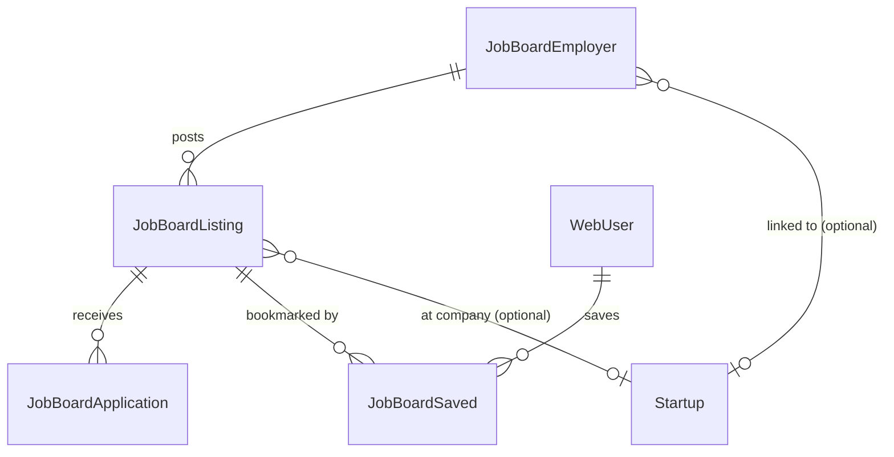

# AI Jobs Platform — Implementation Plan

> An AI Hiring Platform inside AI Startup Impact. Not just a job board — a recruitment engine connected to the startup ecosystem.

---

## Vision

```
AI Startup Impact
├── Startup Directory
├── AI Tool Directory
├── AI Events
├── AI News
├── Founder Stories
├── AI Jobs              ← Public job marketplace
│   └── Employer Portal  ← Company hiring dashboard
```

Every job is connected to: startup profile, founder profile, funding history, news coverage, events, and tools — giving candidates full ecosystem context.

---

## Architecture Overview

```
┌──────────────────────────────────────────────────────┐
│  Public: /jobs                                        │
│  Browse, search, filter AI jobs                       │
│  Job detail pages with company context                │
└───────────────────────────┬──────────────────────────┘
                            │
┌───────────────────────────▼──────────────────────────┐
│  Employer Portal: /employer/*                         │
│  Post jobs, manage applications, analytics            │
└───────────────────────────┬──────────────────────────┘
                            │
┌───────────────────────────▼──────────────────────────┐
│  Integration Layer                                    │
│  • Startup profile → shows open jobs                  │
│  • Newsletter → featured jobs                         │
│  • Search → jobs included in results                  │
│  • Founder portal → link jobs to tools/startups       │
└──────────────────────────────────────────────────────┘
```

---

## What Already Exists

| Component | Status | Details |
|-----------|--------|---------|
| `Job` model (old) | ⚠️ Legacy | Basic model linked to Startup — will keep for existing startup jobs display |
| `JobApplication` model (old) | ⚠️ Legacy | Used by `/careers` (internal hiring) |
| `/careers` page | ✅ Working | **Internal hiring for AI Startup Impact team (separate, not related to job board)** |
| Jobs on startup detail page | ✅ Working | Uses old `Job` model — will migrate to new system |
| `/jobs` page | ⚠️ Redirect | Currently redirects to /newsletter — will become public job board |
| `JobType` enum | ✅ | REMOTE, HYBRID, ONSITE — will reuse |

> **Important**: `/careers` is for hiring AI Startup Impact's own team (interns, editors, etc.). The Job Board is a completely separate product for **external companies** to post AI roles. They share NO models or pages.

---

## Implementation Phases

### Sprint 1: Database & Core Models (Week 1)

#### Schema Changes

> All new models are completely separate from the existing `Job` / `JobApplication` models (which belong to the `/careers` internal hiring page). No shared tables.

```prisma
// ============================================================
// AI JOB BOARD — Employer Platform (Separate from /careers)
// ============================================================

// Employer account (external companies posting AI jobs)
model JobBoardEmployer {
  id              String              @id @default(cuid())
  companyName     String
  slug            String              @unique
  email           String              @unique
  passwordHash    String
  logoUrl         String?
  websiteUrl      String?
  description     String?
  industry        String?
  companySize     String?             // "1-10", "11-50", "51-200", "201-500", "500+"
  location        String?
  country         String?
  linkedinUrl     String?
  twitterUrl      String?
  
  // Link to existing startup profile (optional)
  startupId       String?             @unique
  
  // Plan & billing
  plan            JobBoardPlan        @default(FREE)
  planExpiresAt   DateTime?
  maxActiveJobs   Int                 @default(1)
  
  // Status
  isVerified      Boolean             @default(false)
  isActive        Boolean             @default(true)
  
  // Timestamps
  createdAt       DateTime            @default(now())
  updatedAt       DateTime            @updatedAt
  
  // Relations
  Listings        JobBoardListing[]
  Startup         Startup?            @relation(fields: [startupId], references: [id])
  
  @@index([slug])
  @@index([startupId])
  @@index([isActive])
  @@index([plan])
}

// A job posting on the board
model JobBoardListing {
  id                String              @id @default(cuid())
  slug              String              @unique
  title             String
  description       String              // Markdown rich text
  shortDescription  String?             // 1-2 line excerpt for cards
  
  // Location & type
  location          String?
  city              String?
  country           String?
  workType          JobBoardWorkType    @default(REMOTE)
  visaSponsorship   Boolean             @default(false)
  
  // Compensation
  salaryMin         Int?                // Annual amount
  salaryMax         Int?
  salaryCurrency    String              @default("USD")
  salaryPeriod      String              @default("yearly") // yearly, monthly, hourly
  showSalary        Boolean             @default(true)
  equity            String?             // "0.1% - 0.5%"
  
  // Classification
  category          JobBoardCategory    @default(AI_ENGINEER)
  experienceMin     Int?                // years
  experienceMax     Int?
  skills            String[]            @default([])
  department        String?
  
  // Listing tier & promotion
  listingTier       JobBoardTier        @default(FREE)
  isFeatured        Boolean             @default(false)
  featuredUntil     DateTime?
  isActive          Boolean             @default(true)
  expiresAt         DateTime?
  
  // Application config
  applicationUrl    String?             // External ATS link (optional)
  applicationEmail  String?             // Email to apply (if no portal apply)
  applicationType   JobBoardApplyType   @default(INTERNAL)
  
  // Counters (denormalized)
  applicationsCount Int                 @default(0)
  viewsCount        Int                 @default(0)
  clicksCount       Int                 @default(0)
  savedCount        Int                 @default(0)
  
  // Owner
  employerId        String
  startupId         String?             // Link to startup profile (for "Jobs at X" display)
  
  // SEO
  searchVector      Unsupported("tsvector")?
  
  // Timestamps
  publishedAt       DateTime?
  createdAt         DateTime            @default(now())
  updatedAt         DateTime            @updatedAt
  deletedAt         DateTime?
  
  // Relations
  Employer          JobBoardEmployer    @relation(fields: [employerId], references: [id], onDelete: Cascade)
  Startup           Startup?            @relation(fields: [startupId], references: [id], onDelete: SetNull)
  Applications      JobBoardApplication[]
  SavedBy           JobBoardSaved[]
  
  @@index([isActive, category])
  @@index([isActive, workType])
  @@index([isActive, listingTier])
  @@index([employerId])
  @@index([startupId])
  @@index([slug])
  @@index([publishedAt])
  @@index([expiresAt])
  @@index([searchVector], type: Gin)
}

// Application submitted by a candidate
model JobBoardApplication {
  id            String                  @id @default(cuid())
  listingId     String
  
  // Candidate info
  fullName      String
  email         String
  phone         String?
  linkedinUrl   String?
  portfolioUrl  String?
  githubUrl     String?
  resumeUrl     String
  coverLetter   String?
  
  // Pipeline status
  status        JobBoardAppStatus       @default(APPLIED)
  notes         String?                 // Employer private notes
  rating        Int?                    // 1-5 star
  
  // Timestamps
  appliedAt     DateTime                @default(now())
  reviewedAt    DateTime?
  statusChangedAt DateTime?
  
  // Relations
  Listing       JobBoardListing         @relation(fields: [listingId], references: [id], onDelete: Cascade)
  
  @@unique([listingId, email])          // One application per job per email
  @@index([listingId, status])
  @@index([email])
  @@index([appliedAt])
  @@index([status])
}

// Saved/bookmarked jobs by logged-in users
model JobBoardSaved {
  id        String          @id @default(cuid())
  listingId String
  userId    String
  createdAt DateTime        @default(now())
  Listing   JobBoardListing @relation(fields: [listingId], references: [id], onDelete: Cascade)
  WebUser   WebUser         @relation(fields: [userId], references: [id], onDelete: Cascade)
  
  @@unique([listingId, userId])
  @@index([userId])
  @@index([listingId])
}

// ── Enums ────────────────────────────────────────────

enum JobBoardWorkType {
  REMOTE
  HYBRID
  ONSITE
}

enum JobBoardCategory {
  AI_ENGINEER
  ML_ENGINEER
  LLM_ENGINEER
  AI_RESEARCH_SCIENTIST
  DATA_SCIENTIST
  DATA_ENGINEER
  PROMPT_ENGINEER
  AI_PRODUCT_MANAGER
  AI_DESIGNER
  AI_SALES
  AI_MARKETING
  AI_DEVREL
  AI_SOLUTIONS_ARCHITECT
  AI_ETHICS
  ROBOTICS_ENGINEER
  COMPUTER_VISION
  NLP_ENGINEER
  AI_INFRASTRUCTURE
  OTHER
}

enum JobBoardTier {
  FREE
  FEATURED
  PREMIUM
}

enum JobBoardApplyType {
  INTERNAL    // Apply via platform form
  EXTERNAL    // Redirect to company ATS
}

enum JobBoardAppStatus {
  APPLIED
  REVIEWED
  SHORTLISTED
  INTERVIEW
  OFFER
  HIRED
  REJECTED
}

enum JobBoardPlan {
  FREE        // 1 active job, standard listing, 30 days
  FEATURED    // 5 active jobs, homepage placement, featured badge
  PREMIUM     // Unlimited jobs, newsletter inclusion, social promotion
}
```

#### Relationship to Existing Models

```
NEW (Job Board)                    EXISTING (Untouched)
─────────────────                  ────────────────────
JobBoardEmployer ──┐               Job (old) ← used by /startups/[slug] jobs tab
JobBoardListing    │               JobApplication (old) ← used by /careers page
JobBoardApplication│
JobBoardSaved      │
                   │
          ┌────────┘
          ▼
     Startup (linked via startupId — optional)
     WebUser (linked via userId for saved jobs)
```

- The old `Job` model stays as-is (serves the existing "Jobs at {company}" section on startup pages)
- Migration plan: Once the job board is live, migrate old `Job` entries into `JobBoardListing` and deprecate the old model
- `/careers` page continues using `JobApplication` for AI Startup Impact's own hiring — completely independent

---

### Sprint 2: Employer Portal (Week 2-3)

#### Routes: `/employer/*`

```
apps/web/app/employer/
├── login/page.tsx              → Email/password login
├── signup/page.tsx             → Company registration
├── dashboard/page.tsx          → Overview (active jobs, applications, views)
├── jobs/
│   ├── page.tsx                → Manage all jobs (list with status)
│   ├── new/page.tsx            → Post a new job (form)
│   └── [id]/
│       ├── edit/page.tsx       → Edit job
│       └── applications/page.tsx → View applications for this job
├── applications/page.tsx       → All applications across all jobs
├── company/page.tsx            → Company profile editor
├── analytics/page.tsx          → Hiring analytics
├── promote/page.tsx            → Upgrade plan / promote jobs
├── billing/page.tsx            → Plan management
└── settings/page.tsx           → Account settings
```

#### Auth
- Cookie: `employer_session` (JWT, 30 days)
- Helper: `requireEmployerAuth()` / `getEmployerSession()`
- Pattern: same as organizer auth
- **Completely separate from founder auth or /careers**

#### Employer Dashboard Features

| Feature | Description |
|---------|-------------|
| Overview | Active jobs count, total applications, views this week |
| Post Job | Full form (title, description, category, salary, location, skills, type) |
| Manage Jobs | List with status pills (Active/Expired/Draft), quick actions |
| Applications | Pipeline view (Applied → Reviewed → Shortlisted → Interview → Offer → Hired) |
| Company Profile | Logo, description, website, social links, link to startup |
| Analytics | Views, applications, CTR, traffic sources, top countries |
| Promote | Upgrade listing tier, buy featured placement |
| Billing | Plan management (Free → Featured → Premium) |

---

### Sprint 3: Public Job Board (Week 3-4)

#### Routes: `/jobs/*`

```
apps/web/app/(public)/jobs/
├── page.tsx                    → Job listing with filters
├── [slug]/page.tsx             → Job detail page
├── category/[slug]/page.tsx    → Jobs by category (e.g., /jobs/category/ml-engineer)
└── company/[slug]/page.tsx     → All jobs at a company
```

#### Public Job Listing (/jobs)

**Filters**:
| Filter | Type | Values |
|--------|------|--------|
| Category | Multi-select pills | AI Engineer, ML Engineer, LLM Engineer, etc. |
| Type | Pills | Remote, Hybrid, On-site |
| Experience | Range | 0-2, 2-5, 5-10, 10+ years |
| Salary | Range | Custom min/max |
| Location | Autocomplete | Country → City |
| Company | Search | Company name |
| Visa Sponsorship | Toggle | Yes/No |
| Posted | Select | Last 24h, Last week, Last month |

**Sort**: Newest, Salary (high→low), Featured first

**Job Card Display**:
- Company logo + name
- Job title
- Location + Type badge (Remote/Hybrid/Onsite)
- Salary range (if shown)
- Posted date
- Featured badge (if applicable)
- "Hiring Now" badge (Premium plan)
- Skills pills (top 3)

#### Job Detail Page (/jobs/[slug])

**Sections**:
1. Header: Company logo, job title, location, type, salary, apply button
2. About the role: Full description (markdown rendered)
3. Requirements: Skills, experience, qualifications
4. Benefits: Equity, perks
5. About the company: Auto-pulled from startup profile (if linked)
6. Company's other jobs: List of active positions
7. Similar jobs: Algorithm-based suggestions
8. Apply button (sticky on mobile)

**SEO**: Structured data (`JobPosting` schema), dynamic OG image

---

### Sprint 4: Integration Layer (Week 4-5)

#### Startup Profile Integration

On `/startups/[slug]` page, the "Jobs" tab will display jobs from `JobBoardListing`:
- Jobs linked via `JobBoardListing.startupId` OR `JobBoardEmployer.startupId`
- "View all X jobs" link to `/jobs/company/[employer-slug]`
- No duplicate data — employer manages jobs, startup page reads them

```typescript
// Startup detail page fetches jobs from NEW model:
const jobs = await sql`
  SELECT jl.* FROM "JobBoardListing" jl
  JOIN "JobBoardEmployer" e ON e.id = jl."employerId"
  WHERE (jl."startupId" = ${startupId} OR e."startupId" = ${startupId})
    AND jl."isActive" = true
    AND jl."deletedAt" IS NULL
    AND (jl."expiresAt" IS NULL OR jl."expiresAt" > NOW())
  ORDER BY jl."publishedAt" DESC
`;
```

**Migration path**: Once job board is live:
1. Migrate existing `Job` rows to `JobBoardListing` (create employer accounts for each startup)
2. Update startup detail page query from `Job` → `JobBoardListing`
3. Deprecate old `Job` model (keep in schema but stop writing to it)

> `/careers` page remains unchanged — it uses `JobApplication` model for AI Startup Impact's own team hiring.

#### Founder Portal Integration

Founders who have a linked startup can:
- See "Jobs" section in their founder dashboard
- Link to employer portal to manage hiring
- Or: founder account auto-creates employer account when posting first job

#### Newsletter Integration

- Featured/Premium jobs included in weekly newsletter
- Section: "🔥 AI Jobs This Week" with 3-5 featured positions
- Opt-in for employers (part of Featured/Premium plan)

#### Search Integration

- Jobs included in global search results
- `searchVector` on Job table (title + description + company name)
- Search results show: job title, company, location, salary

---

### Sprint 5: Monetization & Promotions (Week 5-6)

#### Pricing Plans

| Feature | Free | Featured (₹5,000/mo) | Premium (₹15,000/mo) |
|---------|------|---------|---------|
| Active jobs | 1 | 5 | Unlimited |
| Listing placement | Standard | Top of search + homepage | All Featured + newsletter + social |
| Badge | None | "Featured" | "Hiring Now" |
| Newsletter inclusion | ✗ | ✗ | ✓ (weekly) |
| Social promotion | ✗ | ✗ | ✓ (LinkedIn + X + Instagram) |
| Analytics | Basic (views) | Full (views, CTR, sources) | Full + competitive insights |
| Application pipeline | ✓ | ✓ | ✓ + bulk actions |
| Company page boost | ✗ | ✓ | ✓ |
| AI Startup Impact recommendation | ✗ | ✗ | ✓ |
| Duration | 30 days | 30 days | Monthly subscription |

#### Admin Management

```
apps/admin/app/(dashboard)/jobs/
├── page.tsx              → All jobs (approve, feature, manage)
├── employers/page.tsx    → Employer accounts management
└── analytics/page.tsx    → Platform-wide hiring metrics
```

---

### Sprint 6: Analytics & Advanced Features (Week 6-7)

#### Employer Analytics Dashboard

| Metric | Display |
|--------|---------|
| Job views | Per job + total (daily chart) |
| Applications received | Per job + total |
| CTR | Views → Apply clicks |
| Traffic sources | Direct, Search, Newsletter, Social, Startup page |
| Top countries | Geographic breakdown |
| Top cities | City-level breakdown |
| Pipeline conversion | Applied → Reviewed → Shortlisted → Hired |
| Average time to hire | Days from post to first hire |

#### Application Pipeline (Kanban)

```
Applied → Reviewed → Shortlisted → Interview → Offer → Hired
                                                       → Rejected
```

Employer can:
- Drag applications between stages
- Add private notes per candidate
- Rate candidates (1-5 stars)
- Bulk reject / shortlist
- Download resumes

---

## Technical Implementation Details

### Auth (Employer Portal)

```typescript
// apps/web/lib/employer-auth.ts
// Same pattern as organizer-auth

const COOKIE_NAME = 'employer_session';
const JWT_SECRET = new TextEncoder().encode(process.env.USER_JWT_SECRET);

export async function getEmployerSession(): Promise<EmployerSession | null> { ... }
export async function requireEmployerAuth(): Promise<EmployerSession> { ... }
export async function setEmployerSession(employerId, email, companyName): void { ... }
export async function clearEmployerSession(): void { ... }
```

### API Routes

```
apps/web/app/api/employer/
├── auth/
│   ├── signup/route.ts          → POST: Create employer account
│   ├── login/route.ts           → POST: Login
│   └── logout/route.ts          → POST: Logout
├── jobs/
│   ├── route.ts                 → GET: List own jobs, POST: Create job
│   └── [id]/
│       ├── route.ts             → PUT: Update, DELETE: Soft-delete
│       └── applications/route.ts → GET: List applications for this job
├── applications/
│   └── [id]/route.ts            → PUT: Update status/notes/rating
├── company/route.ts             → GET/PUT: Company profile
└── analytics/route.ts           → GET: Hiring metrics

apps/web/app/api/jobs/
├── route.ts                     → GET: Public job search/filter (reads JobBoardListing)
├── [slug]/route.ts              → GET: Job detail
├── [slug]/apply/route.ts        → POST: Submit application (creates JobBoardApplication)
└── [slug]/save/route.ts         → POST: Save/unsave job (toggle, creates JobBoardSaved)
```

> These are completely new routes. They do NOT touch the existing `/api/careers/*` routes.

### Caching Strategy

| Key | TTL | Content |
|-----|-----|---------|
| `jobs:featured` | 10 min | Featured/premium job listings |
| `jobs:recent` | 5 min | Latest 20 jobs |
| `jobs:category:{slug}` | 10 min | Jobs per category |
| `jobs:company:{slug}` | 10 min | Jobs per company |
| `jobs:stats` | 15 min | Total active jobs count |

### SEO

Each job detail page generates `JobPosting` structured data:
```json
{
  "@context": "https://schema.org",
  "@type": "JobPosting",
  "title": "Senior LLM Engineer",
  "description": "...",
  "datePosted": "2026-07-30",
  "validThrough": "2026-08-30",
  "hiringOrganization": {
    "@type": "Organization",
    "name": "Anthropic",
    "sameAs": "https://aistartupimpact.com/startups/anthropic"
  },
  "jobLocation": { "@type": "Place", "address": "Remote" },
  "baseSalary": {
    "@type": "MonetaryAmount",
    "currency": "USD",
    "value": { "@type": "QuantitativeValue", "minValue": 180000, "maxValue": 250000 }
  },
  "employmentType": "FULL_TIME"
}
```

Sitemaps: `/jobs/sitemap.xml` (all active jobs, updated daily)

---

## Database Relationships



> These models are 100% separate from `Job` (old, startup page) and `JobApplication` (old, /careers page).

---

## Permissions Matrix

| Action | Public | Logged-in User | Employer | Admin |
|--------|--------|---------------|----------|-------|
| Browse jobs | ✓ | ✓ | ✓ | ✓ |
| View job detail | ✓ | ✓ | ✓ | ✓ |
| Apply to job | ✗ | ✓ | ✗ | ✗ |
| Save job | ✗ | ✓ | ✗ | ✗ |
| Post job | ✗ | ✗ | ✓ | ✓ |
| Edit own job | ✗ | ✗ | ✓ (own) | ✓ |
| View applications | ✗ | ✗ | ✓ (own jobs) | ✓ |
| Feature job | ✗ | ✗ | ✓ (paid) | ✓ |
| Delete job | ✗ | ✗ | ✓ (own) | SUPER_ADMIN |
| Manage employers | ✗ | ✗ | ✗ | ✓ |

---

## Candidate Experience Flow

```
1. Candidate visits /jobs
2. Browses/filters by category, type, location, salary
3. Clicks job → detail page with full company context
4. Sees: startup profile, funding, team size, other jobs
5. Clicks "Apply"
   ├── INTERNAL: Application form (name, email, resume, LinkedIn, cover letter)
   └── EXTERNAL: Redirect to company ATS
6. Receives confirmation email
7. Can track application status (future: candidate dashboard)
```

---

## Employer Experience Flow

```
1. Company signs up at /employer/signup
2. Completes company profile (logo, description, link to startup)
3. Posts first job (title, description, category, salary, location)
4. Job goes live on /jobs + appears on linked startup profile
5. Applications come in → pipeline view
6. Employer reviews: resume, LinkedIn, portfolio, cover letter
7. Moves candidates through: Applied → Reviewed → Shortlisted → Interview → Offer → Hired
8. Optionally upgrades to Featured/Premium for more visibility
```

---

## Priority Implementation Order

| Sprint | Focus | Deliverable |
|--------|-------|-------------|
| Sprint 1 | Database | Enhanced schema, migrations, enums |
| Sprint 2 | Employer Portal | Auth, dashboard, post/manage jobs |
| Sprint 3 | Public Board | /jobs listing, filters, detail, apply |
| Sprint 4 | Integration | Startup profile jobs, search, newsletter |
| Sprint 5 | Monetization | Plans, payment, featured badges |
| Sprint 6 | Analytics | Employer metrics, pipeline, advanced features |

---

## Success Metrics

| Metric | Target (3 months) | Target (6 months) |
|--------|-------------------|-------------------|
| Active job listings | 50 | 200 |
| Employer accounts | 20 | 80 |
| Applications/month | 200 | 1,000 |
| Paid plans | 5 | 20 |
| Revenue/month | ₹25,000 | ₹2,00,000 |
| Jobs per startup profile | Avg 2 | Avg 4 |

---

## Competitive Advantage

Unlike generic job boards (Indeed, LinkedIn):
1. **Ecosystem context** — Every job linked to startup profile, funding, founders
2. **AI-focused** — Only AI/ML roles, specialized categories
3. **Community trust** — 45K+ LinkedIn followers see featured jobs
4. **Startup visibility** — Candidates see company story, not just a listing
5. **Newsletter reach** — 5,000+ subscribers get featured jobs weekly
6. **Social promotion** — Premium includes LinkedIn/X/Instagram posts
7. **Verified companies** — DNS-verified startups get trust badge on job listings

---

## Files to Create

> All new files. No modification to `/careers` or existing `Job`/`JobApplication` usage.

```
apps/web/
├── app/
│   ├── (public)/jobs/
│   │   ├── page.tsx                → Public job board listing
│   │   ├── [slug]/page.tsx         → Job detail page
│   │   ├── category/[slug]/page.tsx → Jobs by category
│   │   └── company/[slug]/page.tsx  → All jobs at a company
│   ├── employer/
│   │   ├── layout.tsx              → Employer layout (sidebar)
│   │   ├── login/page.tsx          → Employer login
│   │   ├── signup/page.tsx         → Company registration
│   │   ├── dashboard/page.tsx      → Overview stats
│   │   ├── jobs/page.tsx           → Manage all jobs
│   │   ├── jobs/new/page.tsx       → Post a new job
│   │   ├── jobs/[id]/edit/page.tsx → Edit job
│   │   ├── jobs/[id]/applications/page.tsx → Applications for this job
│   │   ├── applications/page.tsx   → All applications (pipeline view)
│   │   ├── company/page.tsx        → Company profile editor
│   │   ├── analytics/page.tsx      → Hiring analytics
│   │   ├── promote/page.tsx        → Upgrade plan / feature jobs
│   │   ├── billing/page.tsx        → Plan management
│   │   └── settings/page.tsx       → Account settings
│   └── api/
│       ├── employer/
│       │   ├── auth/signup/route.ts
│       │   ├── auth/login/route.ts
│       │   ├── auth/logout/route.ts
│       │   ├── jobs/route.ts
│       │   ├── jobs/[id]/route.ts
│       │   ├── jobs/[id]/applications/route.ts
│       │   ├── applications/[id]/route.ts
│       │   ├── company/route.ts
│       │   └── analytics/route.ts
│       └── jobs/
│           ├── route.ts
│           ├── [slug]/route.ts
│           ├── [slug]/apply/route.ts
│           └── [slug]/save/route.ts
├── components/
│   ├── jobs/
│   │   ├── JobCard.tsx             → Job listing card
│   │   ├── JobFilters.tsx          → Filter sidebar/pills
│   │   ├── JobDetail.tsx           → Detail page content
│   │   ├── ApplicationForm.tsx     → Apply form
│   │   └── SaveJobButton.tsx       → Bookmark toggle
│   └── employer/
│       ├── EmployerSidebar.tsx     → Dashboard navigation
│       ├── JobForm.tsx             → Create/edit job form
│       ├── ApplicationPipeline.tsx → Kanban pipeline view
│       └── HiringAnalytics.tsx     → Charts and metrics
└── lib/
    └── employer-auth.ts            → Auth helpers (new, separate)

apps/admin/app/(dashboard)/
├── jobs-board/page.tsx             → Admin: manage all job listings
└── employers/page.tsx              → Admin: manage employer accounts

packages/database/prisma/
└── migrations/YYYYMMDD_ai_jobs_board/migration.sql
```

---

## Related Documents

- [Startup Directory](./STARTUP_DIRECTORY.md) — Integration with startup profiles
- [Authentication](../architecture/AUTHENTICATION.md) — Auth patterns
- [Database Schema](../database/SCHEMA.md) — Existing relationships
- [Monetization Strategy] — Revenue model (future doc)
